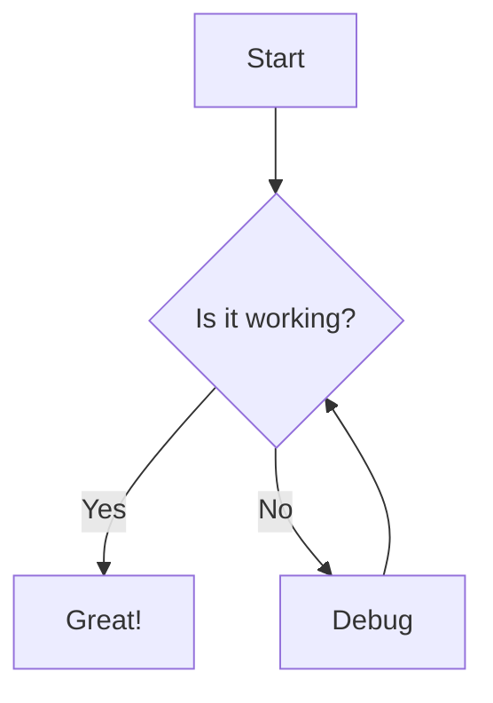

# Diagmarm Builder v0.0.1

A simple web-based tool for creating and visualizing diagrams using the mermaid.js library.

## Overview

Diagmarm Builder provides a straightforward interface for creating mermaid diagrams with two main components:
- A code editor for writing mermaid syntax
- A rendering area to display the resulting diagram

## Features

- Real-time rendering of mermaid diagrams
- Support for all diagram types available in mermaid.js
- Responsive design for various screen sizes
- Simple toolbar with clear and copy functions
- Error handling for invalid mermaid syntax

## Getting Started

1. Clone this repository or download the files
2. Open `index.html` in your web browser
3. Start creating diagrams by editing the mermaid code in the editor panel

No build process or installation is required as the application uses vanilla HTML, CSS, and JavaScript.

## Supported Diagram Types

Diagmarm Builder supports all diagram types available in mermaid.js, including:

- Flowcharts
- Sequence diagrams
- Class diagrams
- State diagrams
- Entity Relationship diagrams
- User Journey diagrams
- Gantt charts
- Pie charts
- And more!

## Example

## Technology Stack

- HTML5
- CSS3
- JavaScript
- Mermaid.js (loaded via CDN)

## Future Enhancements

Future versions of Diagmarm Builder will include:
- AI-powered diagram generation from natural language prompts
- Saving and loading diagrams
- Exporting diagrams in various formats
- Enhanced code editor with syntax highlighting
- User accounts and cloud storage
- Collaborative editing features

## License

This project is open source and available for personal and commercial use.

## Resources

- [Mermaid.js Documentation](https://mermaid.js.org/intro/)
