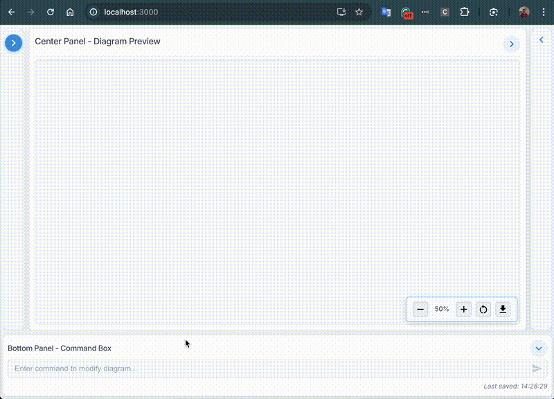
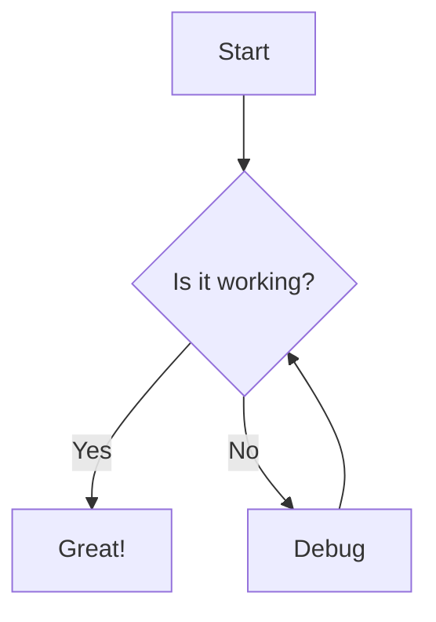

# Diagmarm Builder

A web-based tool for creating and visualizing diagrams using the mermaid.js library, with AI-powered diagram modification capabilities.

## Overview

Diagmarm Builder provides an intuitive interface for creating and editing mermaid diagrams with three main components:
- A code editor for writing mermaid syntax
- A rendering area to display the resulting diagram
- An AI Assistant for modifying diagrams using natural language requests

## Demo



## Features

- Real-time rendering of mermaid diagrams
- Support for all diagram types available in mermaid.js
- AI-powered diagram modification through natural language requests
- Diagram persistence with save/load functionality
- Responsive design with collapsible panels
- Diagram zooming, panning, and downloading capabilities

## Prerequisites

Before installing Diagmarm Builder, ensure you have the following:

- **Python 3.8+** - For the backend server
- **Node.js 14+** - For the frontend application
- **npm** - For managing frontend dependencies
- **Git** - For cloning the repository (optional)
- **Anthropic API Key** - For AI-powered diagram modification

## Installation & Setup

### 1. Clone the Repository

```bash
git clone https://github.com/yourusername/diagmarm-builder.git
cd diagmarm-builder
```

### 2. Backend Configuration

Create a `.env` file in the backend directory:

```bash
cd backend
cp .env.example .env
```

Edit the `.env` file and add your Anthropic API key:

```
ANTHROPIC_API_KEY=your_api_key_here
FLASK_ENV=development
FLASK_DEBUG=1
CORS_ORIGINS=http://localhost:5000,http://127.0.0.1:5000,http://localhost:3000
```

### 3. Using the Makefile (Recommended)

The project includes a Makefile to simplify setup and running:

```bash
# Setup the project (create virtual environment, install dependencies)
make setup
```

## Running the Application

You can run the services in two ways:

### Option 1: Run in Separate Terminal Windows

```bash
# In one terminal, run the backend server
make run-backend

# In another terminal, run the frontend server
make run-frontend
```

### Option 2: Run as Background Services Using Supervisor

```bash
# Start both services in the background
make start

# Check the status of the services
make status

# Stop the services when done
make stop

# Restart the services if needed
make restart
```

### Accessing the Application

Once both services are running, open your browser and navigate to:
- http://localhost:3000

## Manual Setup (Alternative)

If you prefer not to use the Makefile, you can set up the project manually:

### Backend Setup

```bash
cd backend
python3 -m venv .venv
source .venv/bin/activate  # On Windows: .venv\Scripts\activate
pip install -r requirements.txt
python app.py
```

### Frontend Setup

```bash
cd frontend
npm install
npm start
```

## Using Diagmarm Builder

### Creating a New Diagram

1. When you first open the application, you'll see a three-panel interface
2. Use the left panel (Code Editor) to write your mermaid diagram code
3. The diagram will render in real-time in the center panel
4. You can give your diagram a title by clicking the edit button next to the title field

### Using the AI Assistant

1. Create a diagram in the code editor or use an existing one
2. In the bottom panel, enter a natural language request (e.g., "Add a new node for error handling")
3. Click the send button or press Enter to submit your request
4. The AI will process your request and update the diagram code
5. The diagram will automatically update with the changes

### Managing Diagrams

1. Your diagrams are automatically saved as you work
2. Use the right panel to view, select, and manage your saved diagrams
3. Click on a diagram in the list to load it
4. Use the "+" button to create a new diagram
5. Use the delete button to remove a diagram

### Diagram Manipulation

- **Zoom**: Use the mouse wheel or the zoom controls in the bottom right
- **Pan**: Click and drag the diagram to move it around
- **Reset View**: Click the reset button in the controls
- **Download**: Click the download button to save the diagram as an SVG file

## Self-Hosting Guide

### Server Requirements

- Linux, macOS, or Windows server
- Python 3.8+ and Node.js 14+
- 1GB RAM minimum (2GB+ recommended)
- 1GB free disk space

### Production Deployment

For production deployment, consider the following:

1. **Use a Production Web Server**:
   - For the backend, use Gunicorn or uWSGI behind Nginx
   - For the frontend, build the React app and serve it with Nginx

2. **Environment Configuration**:
   - Set `FLASK_ENV=production` in the backend `.env` file
   - Configure proper CORS settings for your domain

3. **Database Considerations**:
   - The default SQLite database is suitable for small deployments
   - For larger deployments, consider using PostgreSQL or MySQL

4. **Security**:
   - Secure your API key
   - Use HTTPS for all connections
   - Implement proper authentication if needed

### Docker Deployment (Optional)

If you prefer using Docker, you can create Docker containers for both the frontend and backend services. A basic `docker-compose.yml` file would include:

```yaml
version: '3'
services:
  backend:
    build: ./backend
    ports:
      - "5000:5000"
    volumes:
      - ./backend:/app
    environment:
      - FLASK_ENV=production
      - ANTHROPIC_API_KEY=your_api_key_here
      
  frontend:
    build: ./frontend
    ports:
      - "3000:3000"
    volumes:
      - ./frontend:/app
    depends_on:
      - backend
```

## Supported Diagram Types

Diagmarm Builder supports all diagram types available in mermaid.js, including:

- Flowcharts
- Sequence diagrams
- Class diagrams
- State diagrams
- Entity Relationship diagrams
- User Journey diagrams
- Gantt charts
- Pie charts
- And more!

### Example



## Troubleshooting

### Common Issues

1. **Backend Connection Error**:
   - Ensure the backend server is running
   - Check that the API key is correctly set in the `.env` file
   - Verify the CORS settings if you're using a custom domain

2. **Diagram Not Rendering**:
   - Check for syntax errors in your mermaid code
   - Ensure the mermaid syntax is supported by the current version

3. **AI Assistant Not Working**:
   - Verify your Anthropic API key is valid and has sufficient credits
   - Check the backend logs for any API-related errors

### Logs

Supervisor stores log files in the `logs` directory:
- `logs/supervisord.log`: Main supervisor log
- `logs/backend_out.log`: Backend service output
- `logs/backend_err.log`: Backend service errors
- `logs/frontend_out.log`: Frontend service output
- `logs/frontend_err.log`: Frontend service errors

## Technology Stack

### Frontend
- React
- TypeScript
- CSS3
- Mermaid.js

### Backend
- Python
- Flask
- LangChain
- Anthropic Claude (via API)
- SQLAlchemy

## License

This project is open source and available for personal and commercial use.

## Resources

- [Mermaid.js Documentation](https://mermaid.js.org/intro/)
- [React Documentation](https://react.dev/)
- [LangChain Documentation](https://python.langchain.com/docs/get_started/introduction)
- [Anthropic Claude Documentation](https://docs.anthropic.com/claude/docs)
