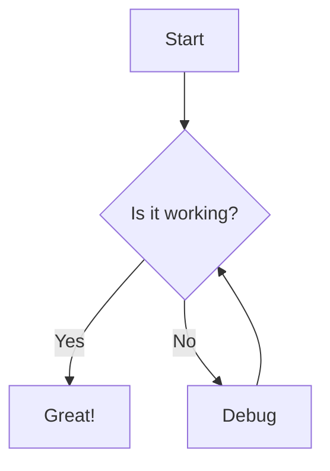

# Diagmarm Builder v0.2.0

A web-based tool for creating and visualizing diagrams using the mermaid.js library, now with AI-powered diagram modification and a React frontend.

## Overview

Diagmarm Builder provides an intuitive interface for creating mermaid diagrams with three main components:
- A code editor for writing mermaid syntax
- A rendering area to display the resulting diagram
- An AI Assistant for modifying diagrams using natural language requests

## Demo


## Features

- Real-time rendering of mermaid diagrams
- Support for all diagram types available in mermaid.js
- AI-powered diagram modification through natural language requests
- Responsive design for various screen sizes
- Simple toolbar with clear and copy functions
- Error handling for invalid mermaid syntax
- Modern React frontend with TypeScript

## Architecture

The application consists of two main parts:
- **Frontend**: React with TypeScript for the user interface
- **Backend**: Python Flask server with LangChain for AI processing

## Getting Started

### Using the Makefile (Recommended)

The project includes a Makefile to simplify setup and running:

1. Clone this repository or download the files
2. Make sure you have Python 3 and Node.js installed
3. Create a `.env` file in the backend directory with your Anthropic API key:
   ```
   ANTHROPIC_API_KEY=your_api_key_here
   FLASK_ENV=development
   FLASK_DEBUG=1
   CORS_ORIGINS=http://localhost:5000,http://127.0.0.1:5000,http://localhost:3000
   ```
4. Run the following commands:

   ```bash
   # Setup the project (create virtual environment, install dependencies)
   make setup
   ```

5. You can run the services in two ways:

   **Option 1: Run in separate terminal windows**
   ```bash
   # In one terminal, run the backend server
   make run-backend

   # In another terminal, run the frontend server
   make run-frontend
   ```

   **Option 2: Run as background services using Supervisor**
   ```bash
   # Start both services in the background
   make start

   # Check the status of the services
   make status

   # Stop the services when done
   make stop

   # Restart the services if needed
   make restart
   ```

6. Open your browser and navigate to http://localhost:3000

### Background Services with Supervisor

The project uses Supervisor to run both the frontend and backend services as background processes. This allows you to:

- Start both services with a single command
- Run the services in the background without keeping terminal windows open
- Automatically restart services if they crash
- Easily check the status of running services

**Available commands:**

- `make start`: Start both services in the background
- `make stop`: Stop all running services
- `make restart`: Restart all services
- `make status`: Check the status of all services

**Log files:**

Supervisor stores log files in the `logs` directory:
- `logs/supervisord.log`: Main supervisor log
- `logs/backend_out.log`: Backend service output
- `logs/backend_err.log`: Backend service errors
- `logs/frontend_out.log`: Frontend service output
- `logs/frontend_err.log`: Frontend service errors

### Manual Setup

#### Frontend Setup (React)
1. Clone this repository or download the files
2. Navigate to the frontend-react directory
3. Install dependencies: `npm install`
4. Start the development server: `npm start`
5. Open your browser and navigate to http://localhost:3000

#### Backend Setup
1. Navigate to the backend directory
2. Create a virtual environment: `python3 -m venv .venv`
3. Activate the virtual environment:
   - Windows: `.venv\Scripts\activate`
   - macOS/Linux: `source .venv/bin/activate`
4. Install dependencies: `pip install -r requirements.txt`
5. Create a `.env` file with your Anthropic API key and other settings:
   ```
   ANTHROPIC_API_KEY=your_api_key_here
   FLASK_ENV=development
   FLASK_DEBUG=1
   CORS_ORIGINS=http://localhost:5000,http://127.0.0.1:5000,http://localhost:3000
   ```
6. Start the Flask server: `python app.py`

## Using the AI Assistant

1. Create a diagram in the code editor or use an existing one
2. Enter a natural language request in the chat box (e.g., "Add a new node for error handling")
3. Click the "Update Diagram" button to send your request
4. The AI will process your request and update the diagram code
5. The diagram will automatically update with the changes

## Supported Diagram Types

Diagmarm Builder supports all diagram types available in mermaid.js, including:

- Flowcharts
- Sequence diagrams
- Class diagrams
- State diagrams
- Entity Relationship diagrams
- User Journey diagrams
- Gantt charts
- Pie charts
- And more!

## Example



## Technology Stack

### Frontend
- React
- TypeScript
- CSS3
- Mermaid.js

### Backend
- Python
- Flask
- LangChain
- Anthropic Claude (via API)

## Future Enhancements

Future versions of Diagmarm Builder will include:
- Enhanced AI capabilities with diagram explanation and optimization
- Saving and loading diagrams
- Exporting diagrams in various formats
- Enhanced code editor with syntax highlighting
- User accounts and cloud storage
- Collaborative editing features

## License

This project is open source and available for personal and commercial use.

## Resources

- [Mermaid.js Documentation](https://mermaid.js.org/intro/)
- [React Documentation](https://react.dev/)
- [LangChain Documentation](https://python.langchain.com/docs/get_started/introduction)
- [Anthropic Claude Documentation](https://docs.anthropic.com/claude/docs)
