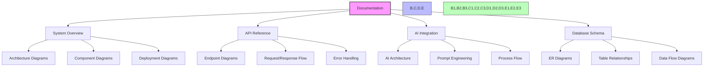

# Diagmarm Builder Backend Documentation

Welcome to the Diagmarm Builder backend documentation. This documentation provides comprehensive information about the backend system, including its architecture, API endpoints, database schema, and AI integration.

## Table of Contents

### 1. [Backend System Documentation](backend_system_documentation.md)
   - System overview
   - Architecture
   - Database schema
   - API endpoints
   - AI-powered diagram modification
   - Folder and diagram management
   - Environment configuration
   - Deployment options

### 2. [API Documentation](api_documentation.md)
   - Authentication
   - Diagram endpoints
   - Folder endpoints
   - System endpoints
   - Error handling
   - Request/response examples

### 3. [AI Integration](ai_integration.md)
   - Overview of AI capabilities
   - Architecture
   - Implementation details
   - Prompt engineering
   - Error handling
   - Future enhancements

### 4. [Database Schema](database_schema.md)
   - Overview
   - Entity relationship diagram
   - Tables
   - Relationships
   - Constraints
   - Indexes
   - Data flow

## Diagrams

The documentation includes various diagrams to help visualize the system:

## Getting Started

To get started with the Diagmarm Builder backend:

1. Review the [Backend System Documentation](backend_system_documentation.md) for an overview of the system
2. Explore the [API Documentation](api_documentation.md) to understand available endpoints
3. Learn about the AI integration in [AI Integration](ai_integration.md)
4. Understand the data model in [Database Schema](database_schema.md)

## Development

For development purposes:

1. Set up the environment variables as described in the [Backend System Documentation](backend_system_documentation.md#environment-configuration)
2. Install dependencies with `pip install -r requirements.txt`
3. Run the development server with `python app.py`

## Deployment

For deployment options, refer to the [Deployment](backend_system_documentation.md#deployment) section in the Backend System Documentation.
