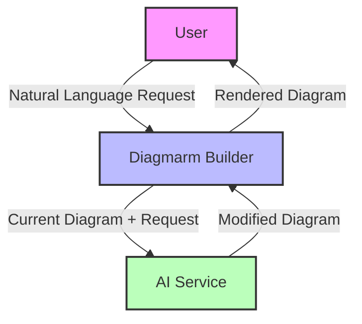
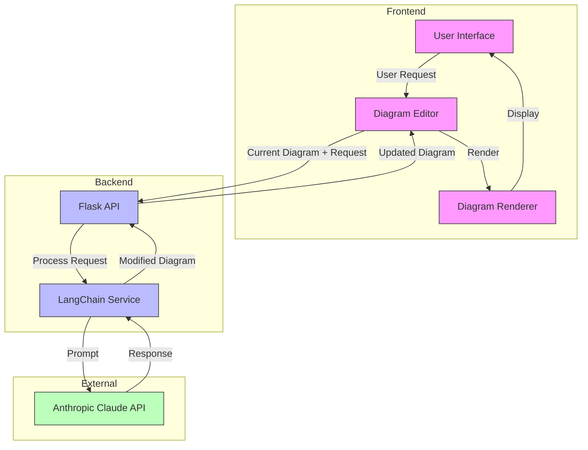
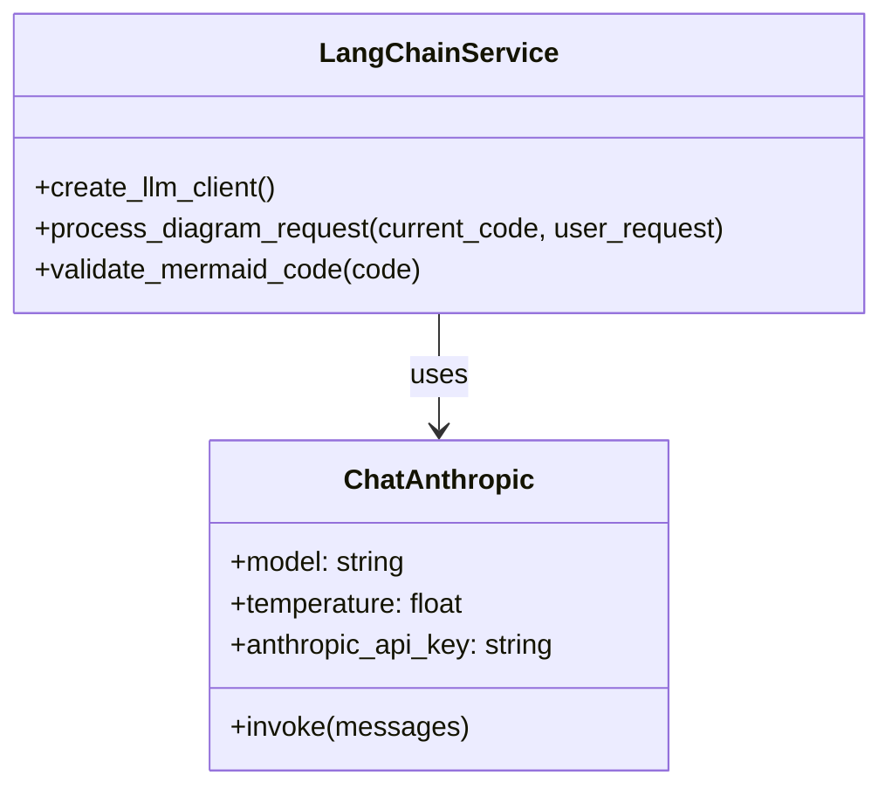
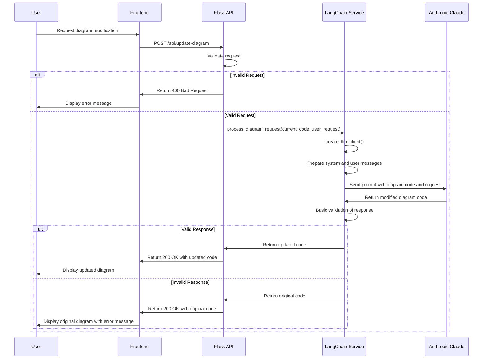
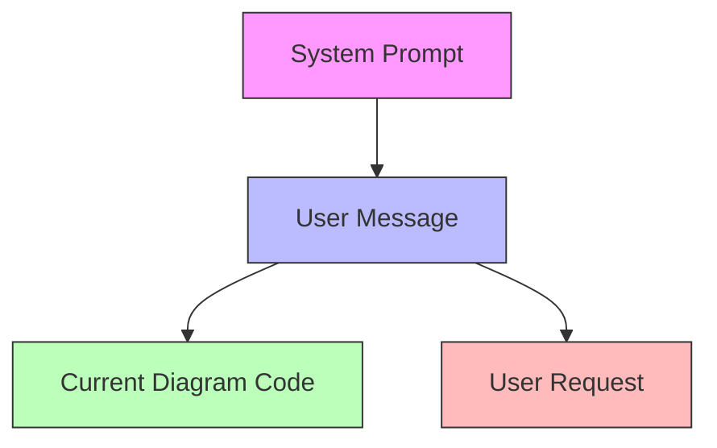
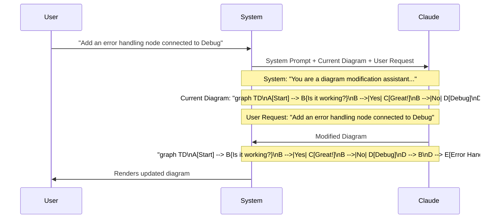
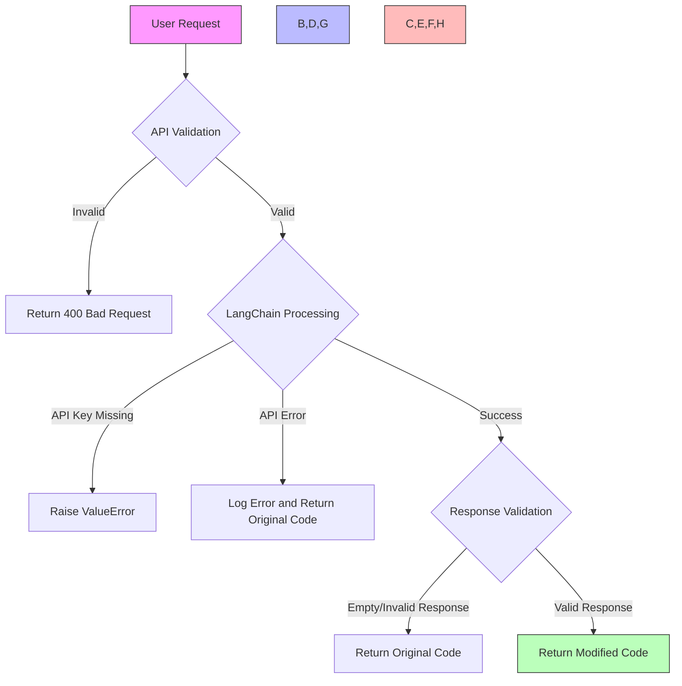
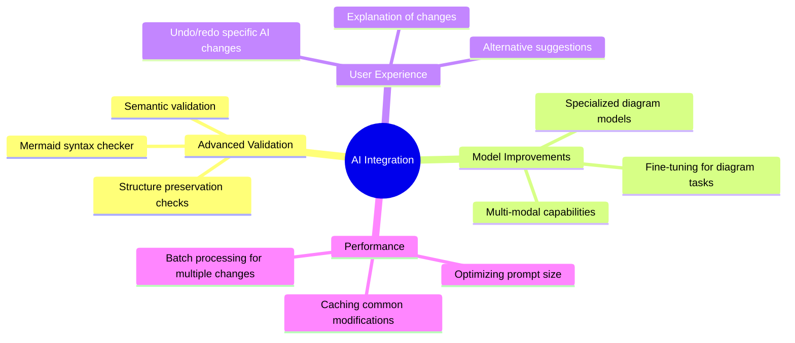

# AI Integration in Diagmarm Builder

This document provides detailed information about the AI integration in the Diagmarm Builder system, focusing on how the application uses Anthropic Claude via LangChain to modify mermaid diagrams based on natural language requests.

## Table of Contents
1. [Overview](#overview)
2. [Architecture](#architecture)
3. [Implementation Details](#implementation-details)
4. [Prompt Engineering](#prompt-engineering)
5. [Error Handling](#error-handling)
6. [Future Enhancements](#future-enhancements)

## Overview

The Diagmarm Builder uses AI to enable users to modify mermaid.js diagrams using natural language requests. This feature allows users to describe changes they want to make to a diagram, and the system will automatically update the diagram code accordingly.



## Architecture

The AI integration follows a clean architecture with clear separation of concerns:



## Implementation Details

### LangChain Service

The LangChain service (`langchain_service.py`) is responsible for processing diagram modification requests. It uses the LangChain framework to interact with the Anthropic Claude API.



### Request Processing Flow

The following sequence diagram illustrates the flow of a diagram modification request:



## Prompt Engineering

The system uses a carefully crafted prompt to instruct Claude on how to modify diagrams. The prompt is designed to:

1. Clearly define the task (modifying mermaid diagrams)
2. Set expectations for the response format (only the modified code)
3. Provide guidelines for making changes
4. Include examples to demonstrate the expected behavior

### System Prompt

```
You are a diagram modification assistant that helps users update mermaid.js diagrams based on natural language requests.

Your task is to modify the provided mermaid diagram code according to the user's request.

Guidelines:
1. Return ONLY the modified mermaid code, without any explanations, markdown formatting, or code blocks.
2. Ensure the modified code is valid mermaid syntax.
3. Preserve the existing structure and style of the diagram while making the requested changes.
4. If the request is unclear or cannot be implemented, return the original code unchanged.
5. Focus on making precise, targeted changes that fulfill the user's request.
```

### Prompt Structure



### Example Interaction



## Error Handling

The AI integration includes several layers of error handling to ensure robustness:



### Error Handling Strategies

1. **API Validation**
   - Checks for required fields in the request
   - Validates that fields are not empty
   - Returns appropriate error messages

2. **LangChain Service Errors**
   - Checks for API key configuration
   - Handles exceptions from the Anthropic API
   - Logs errors for debugging

3. **Response Validation**
   - Basic validation of the returned code
   - Fallback to original code if response is invalid
   - Potential for more advanced validation in the future

## Future Enhancements

The AI integration can be enhanced in several ways:



### Potential Enhancements

1. **Advanced Validation**
   - Implement a more robust mermaid syntax validator
   - Ensure structural integrity of the diagram
   - Validate that the changes match the user's request

2. **Model Improvements**
   - Explore fine-tuning models specifically for diagram tasks
   - Investigate specialized models for different diagram types
   - Add support for multi-modal inputs (e.g., sketches, images)

3. **User Experience**
   - Provide explanations of the changes made
   - Offer alternative suggestions for ambiguous requests
   - Allow users to undo/redo specific AI changes

4. **Performance Optimizations**
   - Cache common modification patterns
   - Optimize prompt size and structure
   - Implement batch processing for multiple changes
