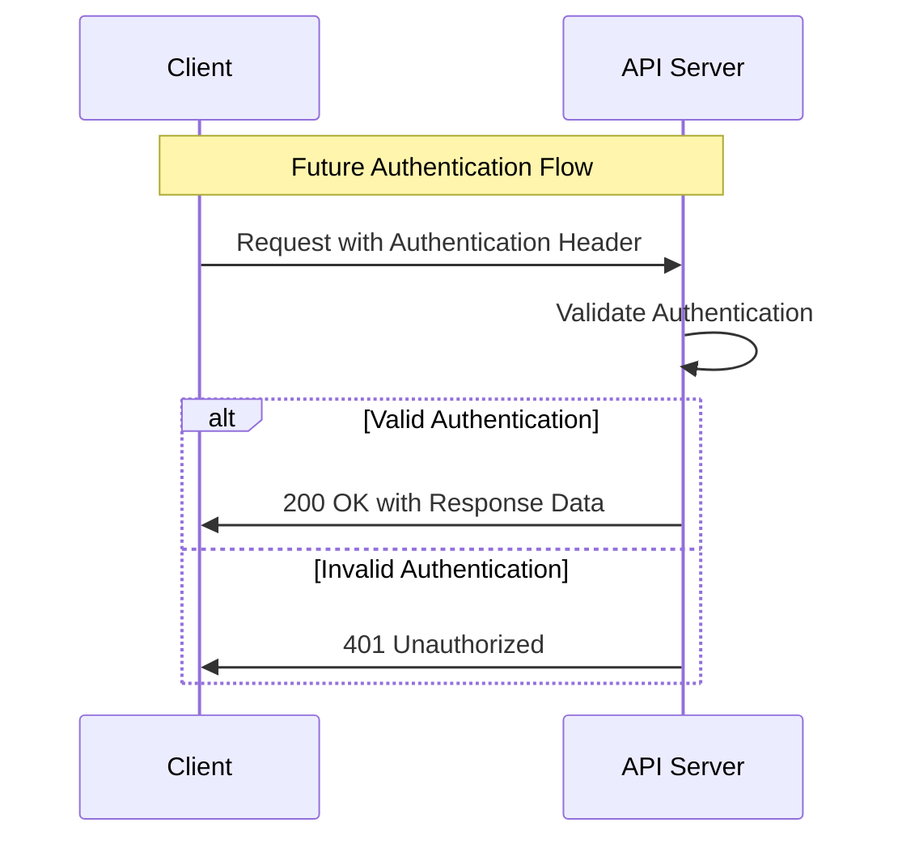
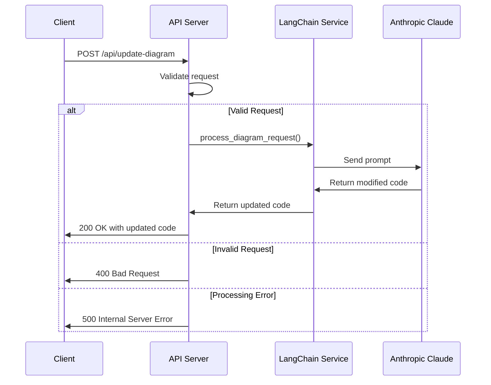
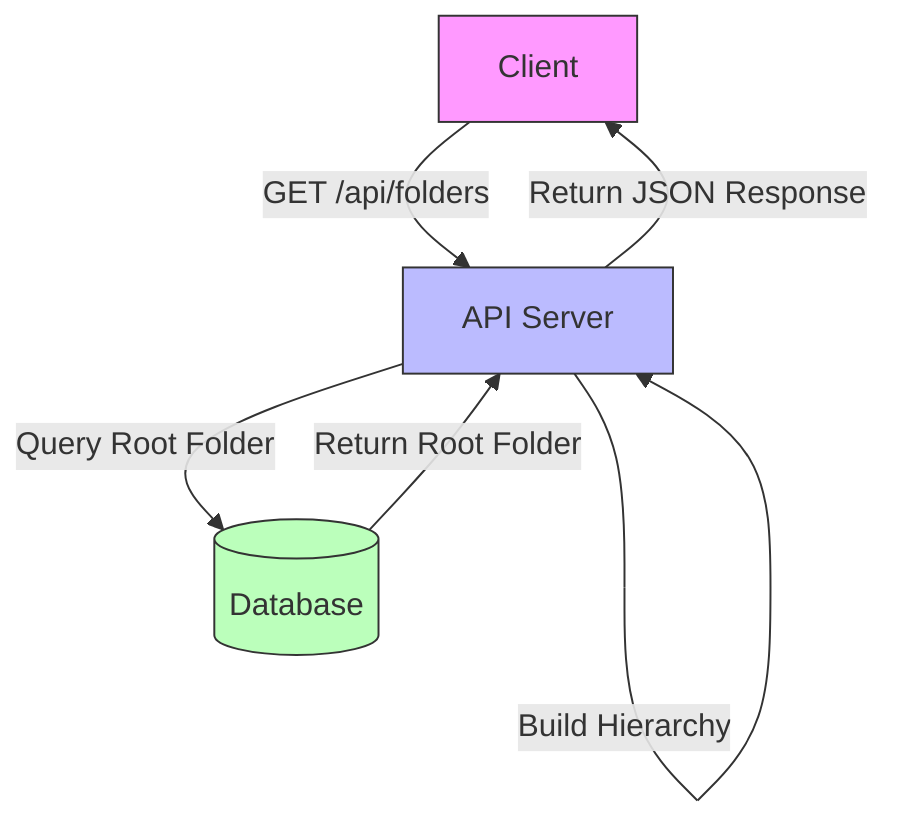
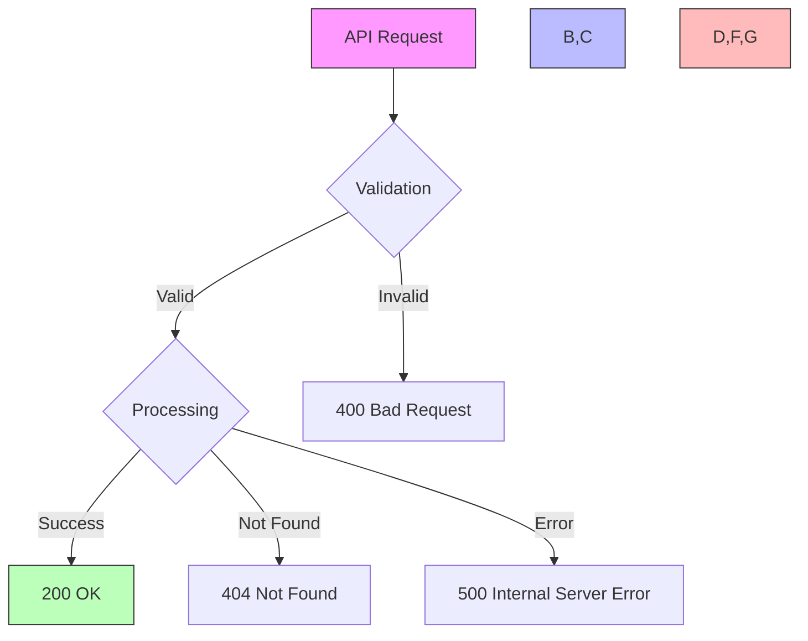
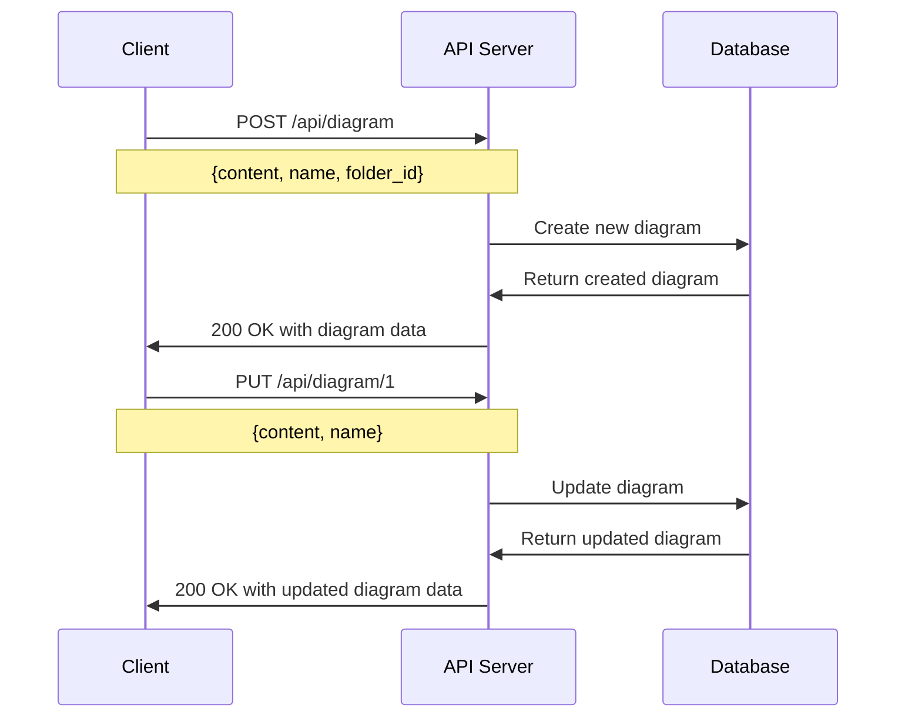
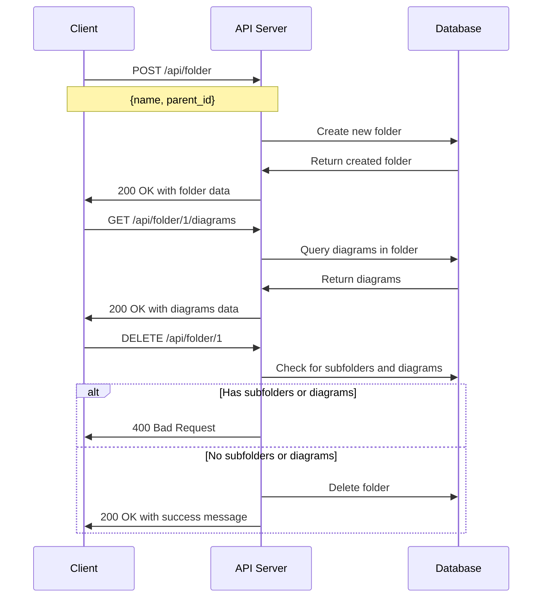

# Diagmarm Builder API Documentation

This document provides detailed information about the API endpoints available in the Diagmarm Builder backend system.

## Table of Contents
1. [Authentication](#authentication)
2. [Diagram Endpoints](#diagram-endpoints)
3. [Folder Endpoints](#folder-endpoints)
4. [System Endpoints](#system-endpoints)
5. [Error Handling](#error-handling)
6. [Request/Response Examples](#requestresponse-examples)

## Authentication

Currently, the API does not implement authentication. All endpoints are publicly accessible. In a production environment, it is recommended to implement authentication using JWT, OAuth, or API keys.



## Diagram Endpoints

### Update Diagram with AI

```
POST /api/update-diagram
```

Updates a mermaid diagram based on a natural language request using AI.

**Request Body:**
```json
{
    "current_code": "graph TD\nA[Start] --> B{Is it working?}\nB -->|Yes| C[Great!]\nB -->|No| D[Debug]\nD --> B",
    "user_request": "Add a new node for error handling"
}
```

**Response:**
```json
{
    "updated_code": "graph TD\nA[Start] --> B{Is it working?}\nB -->|Yes| C[Great!]\nB -->|No| D[Debug]\nD --> B\nD --> E[Error Handling]\nE --> B"
}
```

**Error Response:**
```json
{
    "error": "Failed to process request"
}
```



### Get All Diagrams

```
GET /api/diagrams
```

Retrieves all diagrams in the system.

**Response:**
```json
[
    {
        "id": 1,
        "name": "Diagram 1",
        "last_updated": "2023-10-03T12:34:56"
    },
    {
        "id": 2,
        "name": "Diagram 2",
        "last_updated": "2023-10-04T10:11:12"
    }
]
```

### Get Latest Diagram

```
GET /api/diagram
```

Retrieves the most recently updated diagram.

**Response:**
```json
{
    "id": 2,
    "content": "graph TD\nA[Start] --> B{Is it working?}\nB -->|Yes| C[Great!]\nB -->|No| D[Debug]\nD --> B",
    "last_updated": "2023-10-04T10:11:12",
    "name": "Diagram 2",
    "folder_id": 1
}
```

**Empty Response:**
```json
{
    "content": null
}
```

### Create Diagram

```
POST /api/diagram
```

Creates a new diagram in the system.

**Request Body:**
```json
{
    "content": "graph TD\nA[Start] --> B{Is it working?}\nB -->|Yes| C[Great!]\nB -->|No| D[Debug]\nD --> B",
    "name": "My Diagram",
    "folder_id": 1
}
```

**Response:**
```json
{
    "id": 3,
    "content": "graph TD\nA[Start] --> B{Is it working?}\nB -->|Yes| C[Great!]\nB -->|No| D[Debug]\nD --> B",
    "last_updated": "2023-10-05T09:08:07",
    "name": "My Diagram",
    "folder_id": 1
}
```

### Get Diagram by ID

```
GET /api/diagram/:id
```

Retrieves a specific diagram by its ID.

**Response:**
```json
{
    "id": 1,
    "content": "graph TD\nA[Start] --> B{Is it working?}\nB -->|Yes| C[Great!]\nB -->|No| D[Debug]\nD --> B",
    "last_updated": "2023-10-03T12:34:56",
    "name": "Diagram 1",
    "folder_id": 1
}
```

**Error Response:**
```json
{
    "error": "Diagram with id 999 not found"
}
```

### Update Diagram

```
PUT /api/diagram/:id
```

Updates an existing diagram.

**Request Body:**
```json
{
    "content": "graph TD\nA[Start] --> B{Is it working?}\nB -->|Yes| C[Great!]\nB -->|No| D[Debug]\nD --> B\nD --> E[Error Handling]",
    "name": "Updated Diagram"
}
```

**Response:**
```json
{
    "id": 1,
    "content": "graph TD\nA[Start] --> B{Is it working?}\nB -->|Yes| C[Great!]\nB -->|No| D[Debug]\nD --> B\nD --> E[Error Handling]",
    "last_updated": "2023-10-05T15:16:17",
    "name": "Updated Diagram",
    "folder_id": 1
}
```

### Delete Diagram

```
DELETE /api/diagram/:id
```

Deletes an existing diagram.

**Response:**
```json
{
    "success": true,
    "message": "Diagram with id 1 deleted successfully"
}
```

**Error Response:**
```json
{
    "error": "Diagram with id 999 not found"
}
```

### Move Diagram

```
PUT /api/diagram/:id/move
```

Moves a diagram to a different folder.

**Request Body:**
```json
{
    "folder_id": 2
}
```

**Response:**
```json
{
    "success": true,
    "message": "Diagram with id 1 moved successfully"
}
```

**Error Response:**
```json
{
    "error": "Folder with id 999 not found"
}
```

## Folder Endpoints

### Get Folder Hierarchy

```
GET /api/folders
```

Retrieves the complete folder hierarchy.

**Response:**
```json
[
    {
        "id": 1,
        "name": "Root",
        "parent_id": null,
        "is_root": true,
        "created_at": "2023-10-01T00:00:00",
        "last_updated": "2023-10-01T00:00:00",
        "children": [
            {
                "id": 2,
                "name": "Folder 1",
                "parent_id": 1,
                "is_root": false,
                "created_at": "2023-10-02T00:00:00",
                "last_updated": "2023-10-02T00:00:00",
                "children": []
            }
        ]
    }
]
```



### Create Folder

```
POST /api/folder
```

Creates a new folder.

**Request Body:**
```json
{
    "name": "New Folder",
    "parent_id": 1
}
```

**Response:**
```json
{
    "id": 3,
    "name": "New Folder",
    "parent_id": 1,
    "is_root": false,
    "created_at": "2023-10-05T12:34:56",
    "last_updated": "2023-10-05T12:34:56"
}
```

**Error Response:**
```json
{
    "error": "Parent folder with id 999 not found"
}
```

### Update Folder

```
PUT /api/folder/:id
```

Updates an existing folder.

**Request Body:**
```json
{
    "name": "Updated Folder Name",
    "parent_id": 2
}
```

**Response:**
```json
{
    "id": 3,
    "name": "Updated Folder Name",
    "parent_id": 2,
    "is_root": false,
    "created_at": "2023-10-05T12:34:56",
    "last_updated": "2023-10-05T13:14:15"
}
```

**Error Response:**
```json
{
    "error": "A folder cannot be its own parent"
}
```

### Delete Folder

```
DELETE /api/folder/:id
```

Deletes an existing folder.

**Response:**
```json
{
    "success": true,
    "message": "Folder with id 3 deleted successfully"
}
```

**Error Response:**
```json
{
    "error": "Cannot delete folder containing diagrams. Move or delete diagrams first."
}
```

### Get Diagrams in Folder

```
GET /api/folder/:id/diagrams
```

Retrieves all diagrams in a specific folder.

**Response:**
```json
[
    {
        "id": 1,
        "name": "Diagram 1",
        "last_updated": "2023-10-03T12:34:56",
        "folder_id": 1
    },
    {
        "id": 2,
        "name": "Diagram 2",
        "last_updated": "2023-10-04T10:11:12",
        "folder_id": 1
    }
]
```

**Error Response:**
```json
{
    "error": "Folder with id 999 not found"
}
```

## System Endpoints

### Health Check

```
GET /api/health
```

Simple health check endpoint to verify the API is running.

**Response:**
```json
{
    "status": "ok",
    "message": "Diagmarm Builder API is running"
}
```

## Error Handling

The API uses standard HTTP status codes to indicate the success or failure of requests:



### Common Status Codes

| Status Code | Description |
|-------------|-------------|
| 200 | OK - The request was successful |
| 400 | Bad Request - The request was invalid or cannot be served |
| 404 | Not Found - The requested resource does not exist |
| 500 | Internal Server Error - An error occurred on the server |

### Error Response Format

All error responses follow a consistent format:

```json
{
    "error": "Description of the error"
}
```

## Request/Response Examples

### Example: Creating and Updating a Diagram



### Example: Folder Management



### Example: AI-Powered Diagram Modification

```mermaid
sequenceDiagram
    participant Client
    participant API as API Server
    participant LangChain as LangChain Service
    participant Claude as Anthropic Claude
    
    Client->>API: POST /api/update-diagram
    Note over Client,API: {current_code, user_request}
    
    API->>LangChain: process_diagram_request()
    LangChain->>Claude: Send prompt with diagram code and request
    Claude->>LangChain: Return modified diagram code
    LangChain->>API: Return updated code
    API->>Client: 200 OK with updated code
    
    Client->>API: POST /api/diagram
    Note over Client,API: {content: updated_code, name, folder_id}
    
    API->>API: Save new diagram
    API->>Client: 200 OK with saved diagram
