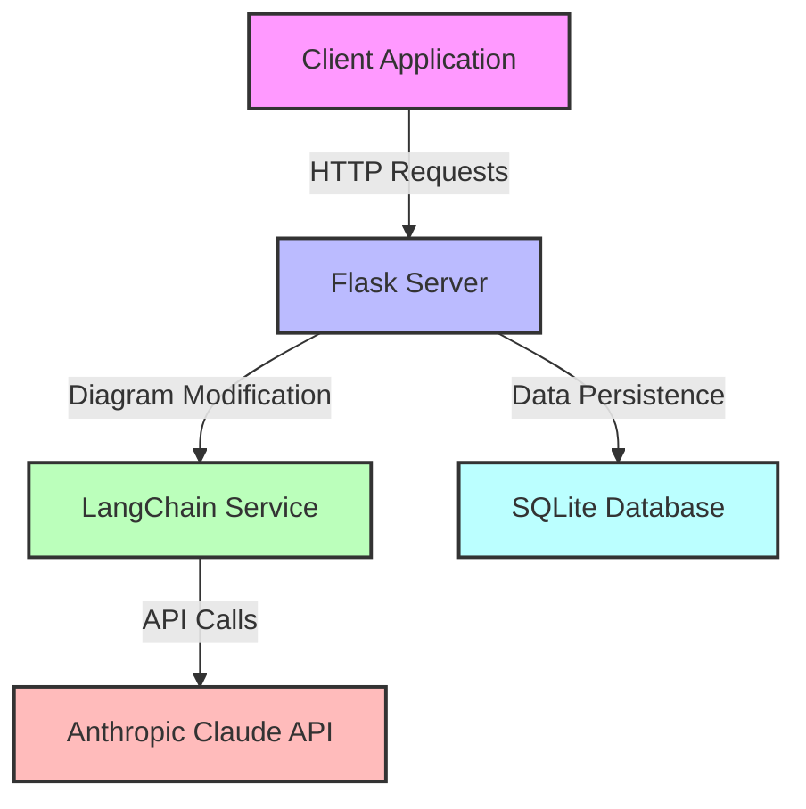
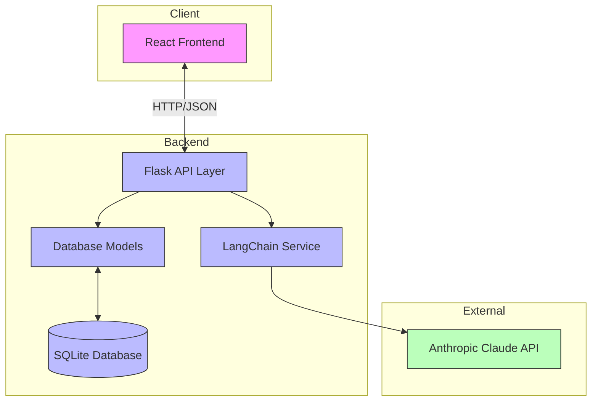
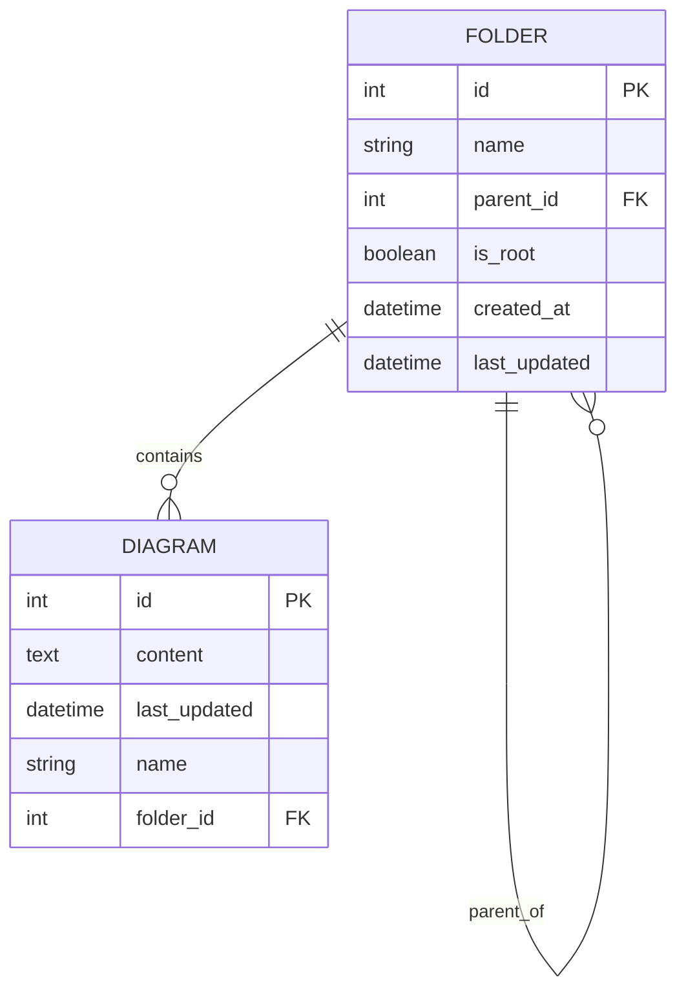
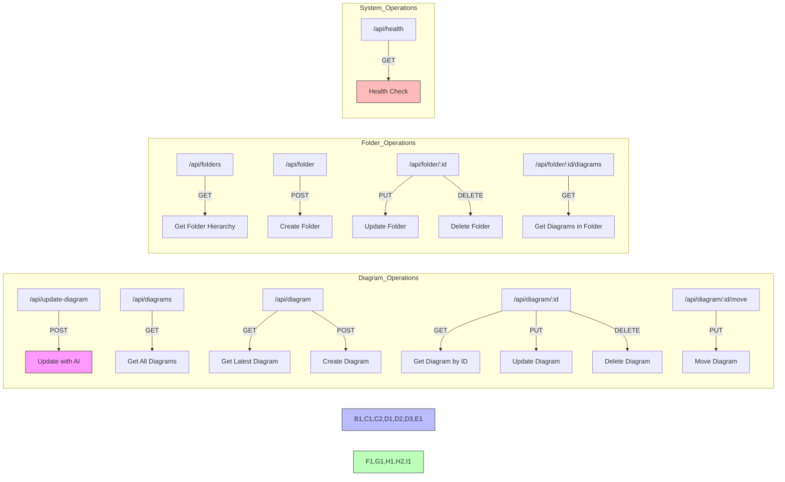
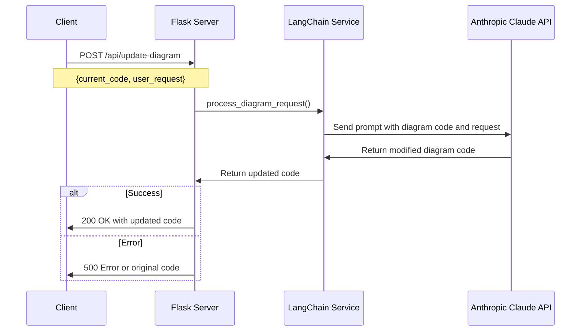
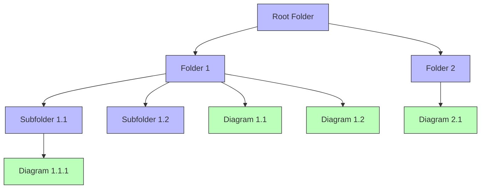
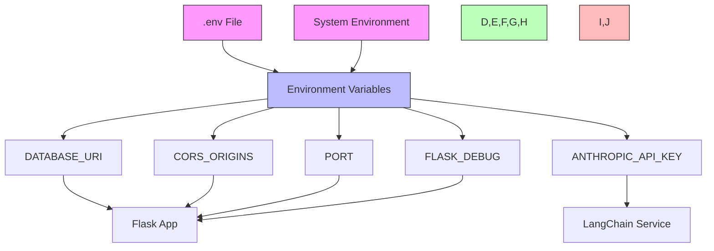
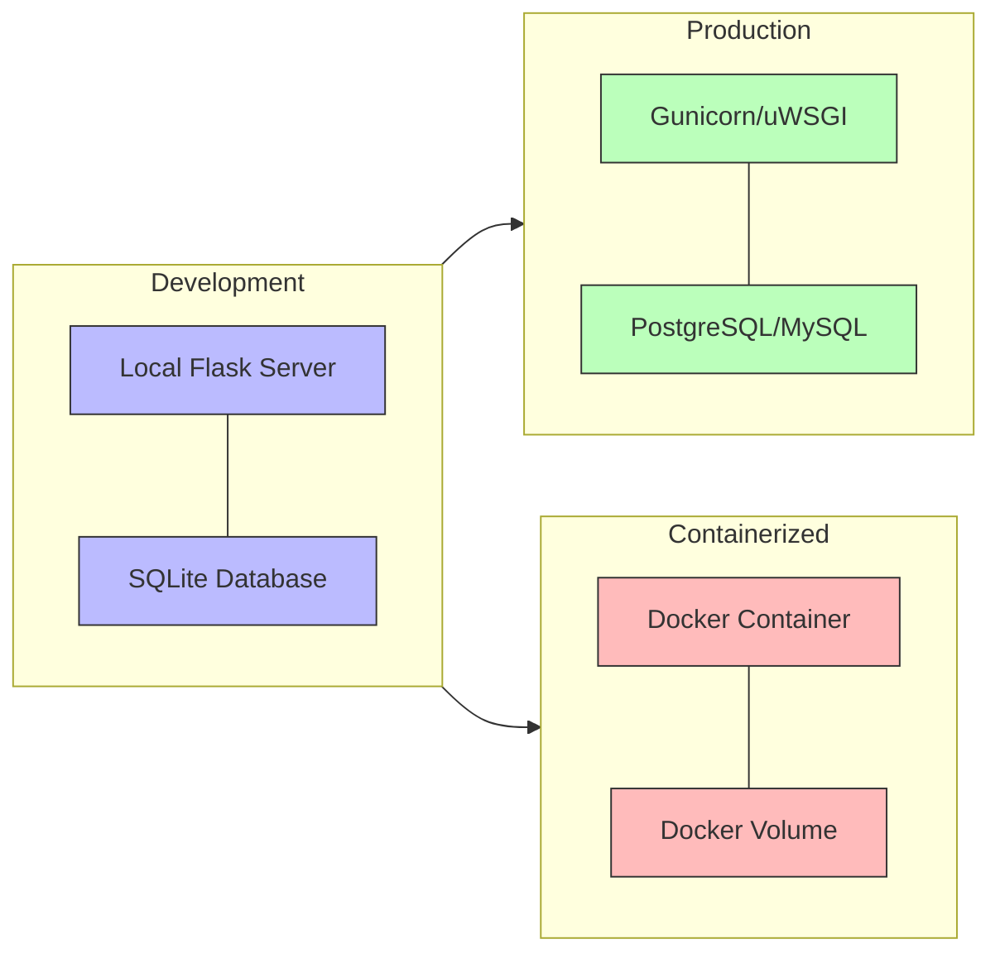

# Diagmarm Builder Backend System Documentation

## Table of Contents
1. [System Overview](#system-overview)
2. [Architecture](#architecture)
3. [Database Schema](#database-schema)
4. [API Endpoints](#api-endpoints)
5. [AI-Powered Diagram Modification](#ai-powered-diagram-modification)
6. [Folder and Diagram Management](#folder-and-diagram-management)
7. [Environment Configuration](#environment-configuration)
8. [Deployment](#deployment)

## System Overview

The Diagmarm Builder backend is a Flask-based web server that provides API endpoints for:
- AI-powered diagram modification using Anthropic Claude
- Diagram persistence and management
- Folder organization for diagrams

The system uses SQLAlchemy for database operations and integrates with LangChain for AI capabilities.



## Architecture

The backend system follows a modular architecture with clear separation of concerns:



### Component Descriptions

1. **Flask API Layer (app.py)**
   - Handles HTTP requests and responses
   - Defines API endpoints for diagram and folder operations
   - Manages database initialization and setup

2. **Database Models (models.py)**
   - Defines SQLAlchemy models for diagrams and folders
   - Implements data validation and relationships
   - Provides serialization methods for API responses

3. **LangChain Service (langchain_service.py)**
   - Integrates with Anthropic Claude API
   - Processes diagram modification requests
   - Handles AI-related error handling and fallbacks

## Database Schema

The database schema consists of two main entities: Folders and Diagrams.



### Entity Relationships

- A folder can contain multiple diagrams
- A folder can have multiple child folders (hierarchical structure)
- Each diagram belongs to exactly one folder
- There is exactly one root folder in the system

### Database Constraints

- Only one root folder can exist in the system
- The root folder cannot have a parent
- A folder cannot be its own parent (prevents circular references)
- A folder cannot be deleted if it contains diagrams or subfolders

## API Endpoints

The backend provides the following RESTful API endpoints:



### Diagram API Endpoints

| Endpoint | Method | Description |
|----------|--------|-------------|
| `/api/update-diagram` | POST | Update a mermaid diagram based on a natural language request |
| `/api/diagrams` | GET | Retrieve all diagrams |
| `/api/diagram` | GET | Retrieve the latest diagram |
| `/api/diagram` | POST | Create a new diagram |
| `/api/diagram/:id` | GET | Retrieve a specific diagram by ID |
| `/api/diagram/:id` | PUT | Update an existing diagram |
| `/api/diagram/:id` | DELETE | Delete an existing diagram |
| `/api/diagram/:id/move` | PUT | Move a diagram to a different folder |

### Folder API Endpoints

| Endpoint | Method | Description |
|----------|--------|-------------|
| `/api/folders` | GET | Retrieve the folder hierarchy |
| `/api/folder` | POST | Create a new folder |
| `/api/folder/:id` | PUT | Update an existing folder |
| `/api/folder/:id` | DELETE | Delete an existing folder |
| `/api/folder/:id/diagrams` | GET | Retrieve all diagrams in a specific folder |

### System API Endpoints

| Endpoint | Method | Description |
|----------|--------|-------------|
| `/api/health` | GET | Simple health check endpoint |

## AI-Powered Diagram Modification

The system uses Anthropic Claude via LangChain to modify mermaid diagrams based on natural language requests.



### Diagram Modification Process

1. The client sends a POST request to `/api/update-diagram` with the current diagram code and a natural language request
2. The Flask server validates the request and calls the LangChain service
3. The LangChain service prepares a prompt for Anthropic Claude with the diagram code and user request
4. Anthropic Claude generates a modified version of the diagram code
5. The LangChain service validates the response and returns it to the Flask server
6. The Flask server returns the updated code to the client

### System Prompt

The system uses a carefully crafted prompt to instruct Claude on how to modify diagrams:

```
You are a diagram modification assistant that helps users update mermaid.js diagrams based on natural language requests.

Your task is to modify the provided mermaid diagram code according to the user's request.

Guidelines:
1. Return ONLY the modified mermaid code, without any explanations, markdown formatting, or code blocks.
2. Ensure the modified code is valid mermaid syntax.
3. Preserve the existing structure and style of the diagram while making the requested changes.
4. If the request is unclear or cannot be implemented, return the original code unchanged.
5. Focus on making precise, targeted changes that fulfill the user's request.
```

## Folder and Diagram Management

The system implements a hierarchical folder structure for organizing diagrams.



### Folder Management Features

- Hierarchical folder structure with a single root folder
- Creation, updating, and deletion of folders
- Moving diagrams between folders
- Retrieving the folder hierarchy
- Retrieving diagrams within a specific folder

### Diagram Management Features

- Creation, updating, and deletion of diagrams
- Moving diagrams between folders
- Retrieving all diagrams or specific diagrams by ID
- Retrieving the latest diagram

## Environment Configuration

The backend system uses environment variables for configuration. These can be set in a `.env` file or directly in the environment.



### Required Environment Variables

| Variable | Description | Default |
|----------|-------------|---------|
| `DATABASE_URI` | SQLAlchemy database connection URI | `sqlite:///diagrams.db` |
| `CORS_ORIGINS` | Comma-separated list of allowed origins for CORS | `http://localhost:5000,http://127.0.0.1:5000,http://localhost:3000` |
| `ANTHROPIC_API_KEY` | API key for Anthropic Claude | None (required) |
| `PORT` | Port for the Flask server | `5000` |
| `FLASK_DEBUG` | Enable debug mode (0 or 1) | `0` |

## Deployment

The backend system can be deployed in various environments.



### Deployment Options

1. **Development Environment**
   - Run with `python app.py` or `flask run`
   - Uses SQLite database
   - Debug mode enabled

2. **Production Environment**
   - Run with Gunicorn or uWSGI
   - Use a production database like PostgreSQL or MySQL
   - Configure with environment variables
   - Set up proper logging

3. **Containerized Deployment**
   - Package in a Docker container
   - Use Docker Compose for multi-container setup
   - Configure with environment variables
   - Use volumes for persistent storage

### Deployment Considerations

- Set up proper logging for production
- Configure a production-ready database
- Set up proper error handling and monitoring
- Configure CORS for production domains
- Secure the API with authentication if needed
- Set up rate limiting for the AI-powered endpoints
