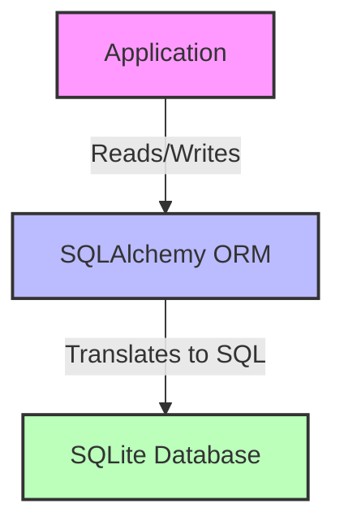
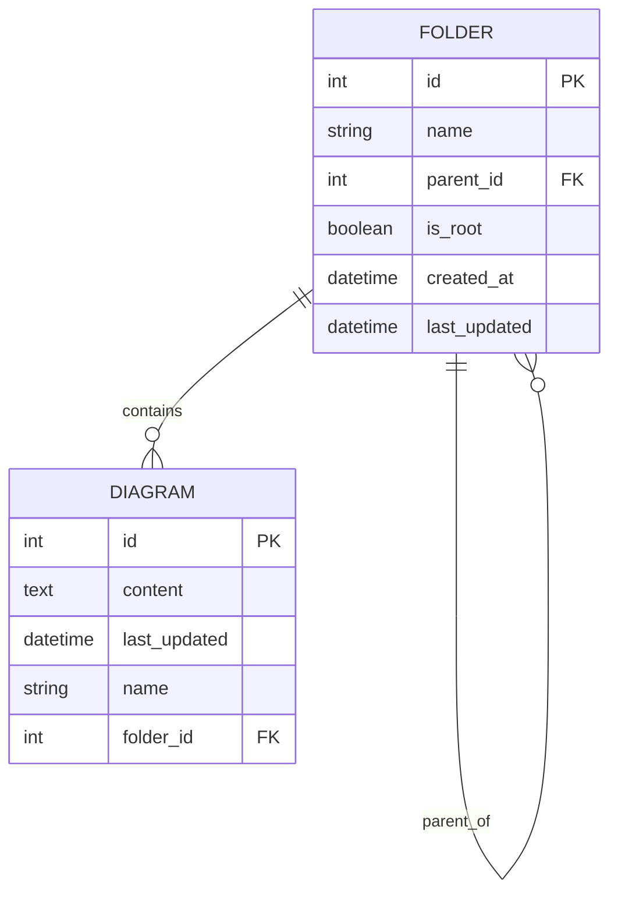
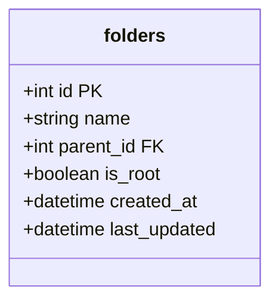
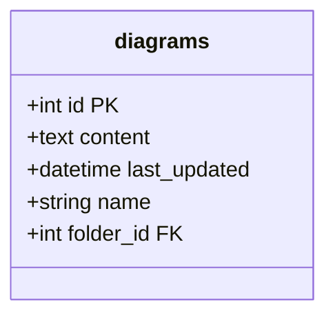
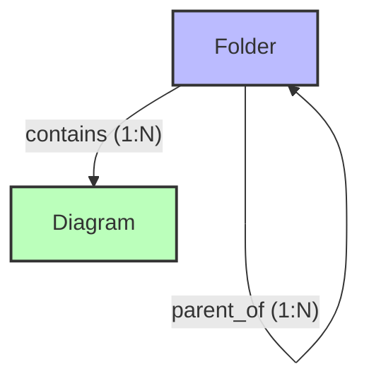
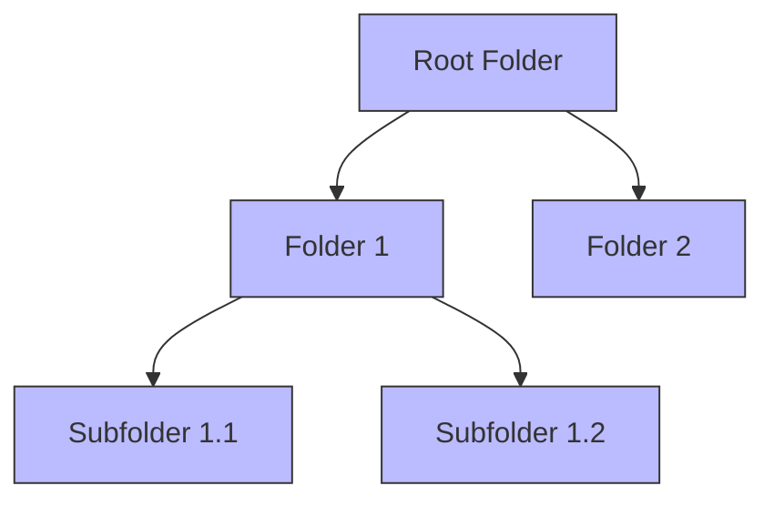
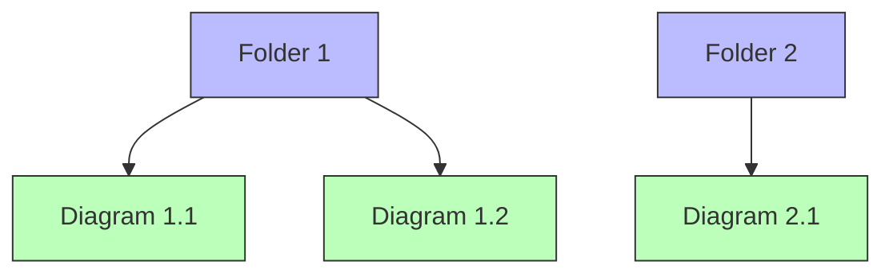
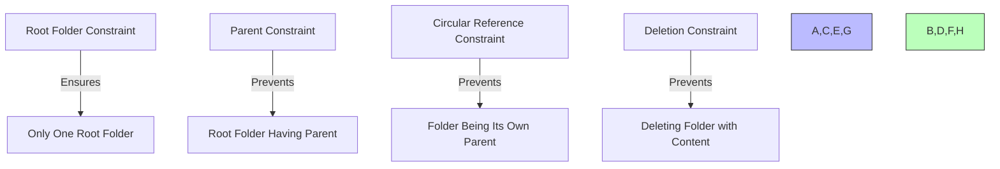
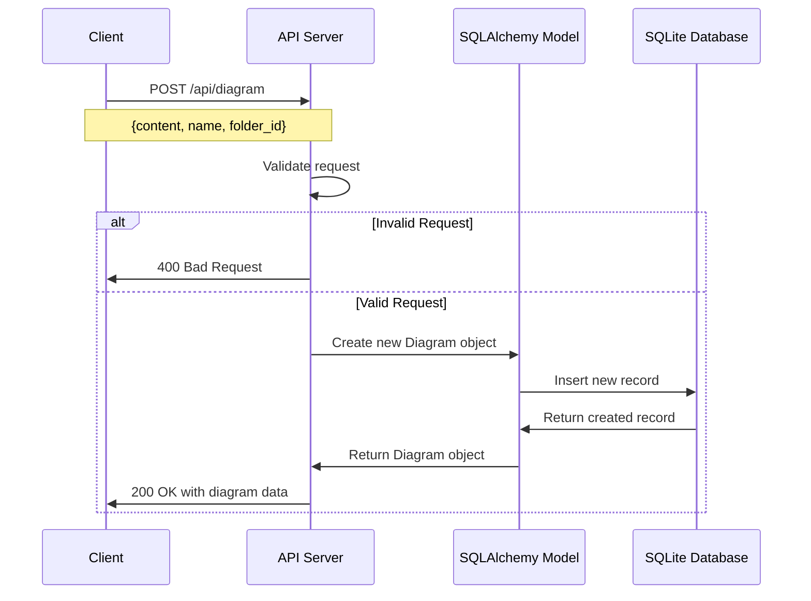
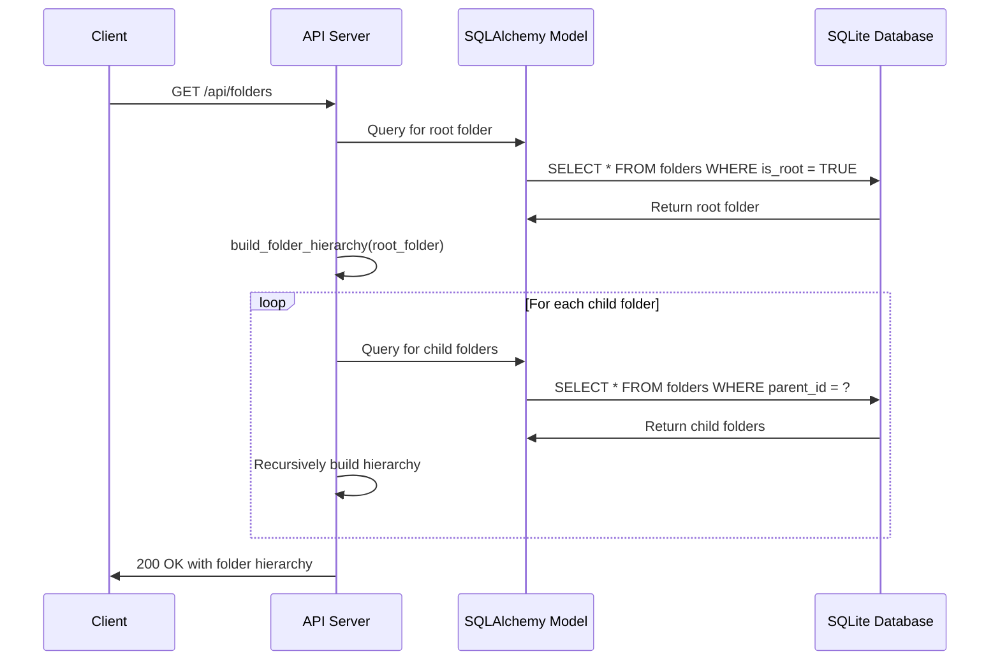

# Diagmarm Builder Database Schema Documentation

This document provides detailed information about the database schema used in the Diagmarm Builder system.

## Table of Contents
1. [Overview](#overview)
2. [Entity Relationship Diagram](#entity-relationship-diagram)
3. [Tables](#tables)
4. [Relationships](#relationships)
5. [Constraints](#constraints)
6. [Indexes](#indexes)
7. [Data Flow](#data-flow)

## Overview

The Diagmarm Builder uses SQLAlchemy with SQLite (in development) to store and manage diagrams and folders. The database schema is designed to support a hierarchical folder structure for organizing diagrams.



## Entity Relationship Diagram

The database schema consists of two main entities: Folders and Diagrams.



## Tables

### Folders Table

The `folders` table stores information about folders used to organize diagrams.



| Column | Type | Description | Constraints |
|--------|------|-------------|-------------|
| id | Integer | Unique identifier for the folder | Primary Key, Auto-increment |
| name | String(255) | Name of the folder | Not Null |
| parent_id | Integer | ID of the parent folder | Foreign Key to folders.id, Nullable |
| is_root | Boolean | Flag indicating if this is the root folder | Not Null, Default: False |
| created_at | DateTime | When the folder was created | Default: Current timestamp |
| last_updated | DateTime | When the folder was last updated | Default: Current timestamp, Auto-update |

### Diagrams Table

The `diagrams` table stores information about mermaid diagrams.



| Column | Type | Description | Constraints |
|--------|------|-------------|-------------|
| id | Integer | Unique identifier for the diagram | Primary Key, Auto-increment |
| content | Text | Mermaid diagram code | Not Null |
| last_updated | DateTime | When the diagram was last updated | Default: Current timestamp, Auto-update |
| name | String(255) | Name of the diagram | Nullable |
| folder_id | Integer | ID of the folder containing the diagram | Foreign Key to folders.id, Not Null |

## Relationships

The database schema includes the following relationships:



### Folder to Folder (Self-Referential)

- A folder can have multiple child folders (one-to-many self-referential relationship)
- Each folder (except the root) has exactly one parent folder
- The relationship is defined by the `parent_id` foreign key in the `folders` table



### Folder to Diagram

- A folder can contain multiple diagrams (one-to-many relationship)
- Each diagram belongs to exactly one folder
- The relationship is defined by the `folder_id` foreign key in the `diagrams` table



## Constraints

The database schema includes several constraints to maintain data integrity:



### Root Folder Constraint

- Only one folder can have `is_root = True`
- Implemented using an SQLAlchemy event listener on the `Folder` model
- Raises a `ValueError` if attempting to create a second root folder

```python
@event.listens_for(Folder, 'before_insert')
def check_root_folder_before_insert(mapper, connection, folder):
    if folder.is_root:
        # Check if a root folder already exists
        root_count = connection.execute(
            db.select(db.func.count()).select_from(Folder).where(Folder.is_root == True)
        ).scalar()
        
        if root_count > 0:
            raise ValueError("Only one root folder can exist in the system")
```

### Parent Constraint

- The root folder cannot have a parent
- Implemented using an SQLAlchemy event listener on the `Folder` model
- Raises a `ValueError` if attempting to set a parent for the root folder

```python
@event.listens_for(Folder, 'before_update')
def check_root_folder_before_update(mapper, connection, folder):
    if folder.is_root and folder.parent_id is not None:
        raise ValueError("Root folder cannot have a parent")
```

### Circular Reference Constraint

- A folder cannot be its own parent (directly or indirectly)
- Implemented in the API layer
- Returns a 400 Bad Request if attempting to create a circular reference

### Deletion Constraints

- Cannot delete a folder that contains diagrams
- Cannot delete a folder that contains subfolders
- Implemented in the API layer
- Returns a 400 Bad Request if attempting to delete a folder with content

## Indexes

The database schema includes the following indexes to optimize query performance:

| Table | Column(s) | Index Type | Purpose |
|-------|-----------|------------|---------|
| folders | parent_id | Foreign Key | Optimize queries for finding child folders |
| folders | is_root | Regular | Quickly find the root folder |
| diagrams | folder_id | Foreign Key | Optimize queries for finding diagrams in a folder |
| diagrams | last_updated | Regular | Optimize sorting by last updated timestamp |

## Data Flow

The following diagrams illustrate how data flows through the system:

### Creating a New Diagram



### Retrieving the Folder Hierarchy



### Moving a Diagram to a Different Folder

```mermaid
sequenceDiagram
    participant Client
    participant API as API Server
    participant Model as SQLAlchemy Model
    participant DB as SQLite Database
    
    Client->>API: PUT /api/diagram/1/move
    Note over Client,API: {folder_id: 2}
    
    API->>Model: Query for diagram
    Model->>DB: SELECT * FROM diagrams WHERE id = 1
    DB->>Model: Return diagram
    
    API->>Model: Query for target folder
    Model->>DB: SELECT * FROM folders WHERE id = 2
    DB->>Model: Return folder
    
    API->>Model: Update diagram.folder_id = 2
    Model->>DB: UPDATE diagrams SET folder_id = 2 WHERE id = 1
    DB->>Model: Return success
    
    API->>Client: 200 OK with success message
